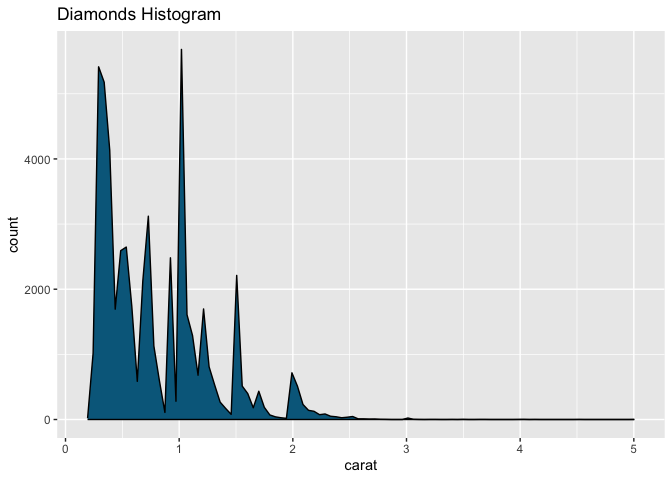
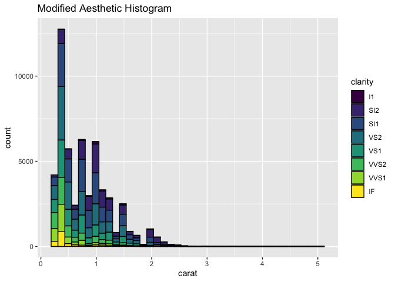
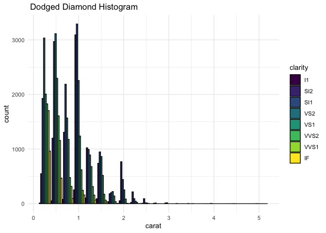

```{r setup, include=FALSE}
knitr::opts_chunk$set(
	message = TRUE,
	warning = TRUE,
	include = FALSE
)
library(ggplot2)
library(tidyr)
library(dcldata)

data(diamonds)

df = diamonds
head(df)
```


# DATASET
```{r dataset, echo=TRUE, message=TRUE, warning=TRUE, paged.print=TRUE}
head(df,5)
```
## 1. Create a histogram on the diamonds dataset,

```{r 1histo, echo=TRUE, message=FALSE, fig.retina=1}
ggplot(df, aes(x = carat)) +
  geom_histogram(color = "black", fill='deepskyblue4', bins=30) +
  labs(
    title = "Diamonds Histogram"
   ) 
```


```{r 1layer}
histogram_layer <- function(fill_color = "deepskyblue4", bins = 30) {
  layer(
    geom = "bar", 
    stat = "bin",
    mapping = NULL,
    position = "stack",
    params = list(
      color = "black",
      fill = fill_color,
      bins = bins
    )
  )
}

ggplot(diamonds, aes(x = carat)) +
  histogram_layer() +
  labs(title = "Diamonds Histogram")
```


## 2. Remember that a histogram is a plot with stat_bin and geom_bar. Modify your histogram code so that it uses a different geom, for example geom_line or geom_point. This should be simple once you have the layer specification of a histogram.

```{r 2layer, echo=TRUE}
histogram_layer <- function(fill_color = "deepskyblue4", bins = 100) {
  layer(
    geom = "density", 
    stat = "bin",
    mapping = NULL,
    position = "stack",
    params = list(
      color = "black",
      fill = fill_color,
      bins = bins
    )
  )
}

ggplot(diamonds, aes(x = carat)) +
  histogram_layer() +
  labs(title = "Diamonds Density")
```


## 3. In your histogram (the one plotted with bars that you created in question 1), add an aesthetic mapping from one of the factor variables (maybe color or clarity) to the fill or color aesthetic.
```{r aes, echo=FALSE}
ggplot(diamonds, aes(x = carat, fill = clarity)) +
  geom_histogram(bins=40, fill_color = 'clarity', color = 'black') +
  labs(title = "Modified Aesthetic Histogram")
```



## 4. What is the default position adjustment for a histogram? Try changing the position adjustment in the histogram you created in question 3 to something different (hint: try dodge). 
```{r dodge, echo=FALSE}
ggplot(diamonds, aes(x = carat, fill = clarity)) +
  geom_histogram(bins=20, color = "black", line = 0.1, position = 'dodge') +
  labs(title = " Dodged Diamond Histogram") +
  theme_minimal()
```

