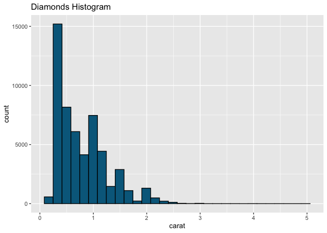

# DATASET

## 1. Create a histogram on the diamonds dataset,

<figure>

<figcaption aria-hidden="true">Diamond Histogram</figcaption>
</figure>

### Using layer function

<figure>

<figcaption aria-hidden="true">Diamond Histogram</figcaption>
</figure>
